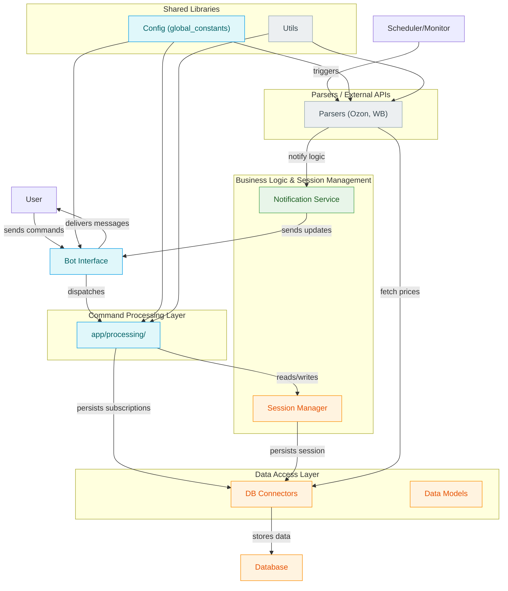

# Sale Hunter 🎯

**sale-hunter** is a powerful Python-based tool designed for monitoring and notifying users about sales and price changes on popular e-commerce platforms such as Ozon and Wildberries (WB). It supports automated scheduling to fetch prices and sends intelligent notifications upon detecting relevant updates.

Make sure to view the [Live Demo](https://t.me/sale_hunter_by_bot) 

English| [Русский](./docs/russian-README.md)

## ✨ Features

- **Multi-platform Monitoring**: Track product prices from Ozon and Wildberries via specialized parsers
- **Smart Scheduling**: Configure periodic price checks with customizable intervals
- **Session Management**: Maintain user sessions and personalized subscriptions
- **Telegram Bot Interface**: Intuitive bot commands for easy interaction
- **Real-time Notifications**: Instant alerts for price drops and sales
- **Persistent Storage**: Reliable database integration for data persistence
- **Modular Architecture**: Clean separation of concerns for maintainability

## 🏗 Architecture Overview

The project follows a modular architecture with clearly defined layers:



### Key Components

- **Bot Interface**: Handles user commands and message delivery via Telegram
- **Command Processing**: Manages command parsing and session management
- **Business Logic & Session Management**: Maintains user sessions and notification logic
- **Parsers**: Interfaces with external APIs (Ozon, WB) to fetch product data
- **Data Access Layer**: Connects to the database and persists data models
- **Scheduler**: Triggers routine price checks and updates
- **Notification Service**: Sends notifications to users based on price changes

## 🚀 Quick Start

### Prerequisites

- Python 3.8+
- Telegram Bot Token (from [BotFather](https://t.me/BotFather))
- Database (SQLite by default, configurable to PostgreSQL)

### Installation

1. **Clone the repository**:
   ```bash
   git clone https://github.com/baikoby228/sale-hunter.git
   cd sale-hunter
   ```

2. **Install dependencies**:
   ```bash
   pip install -r requirements.txt
   ```

3. **Configuration**:
   Copy the environment template and configure your settings:
   ```bash
   cp .env.example .env
   # Edit .env with your credentials
   ```

4. **Database Setup**:
   ```bash
   python scripts/setup_database.py
   ```

### Usage

1. **Start the bot**:
   ```bash
   python bot.py
   ```

2. **Interact with the bot**:
   - Start: `/start` - Initialize your session
   - Add product: `/add <product_url>` - Monitor a new product
   - List subscriptions: `/list` - View your monitored products
   - Remove product: `/remove <product_id>` - Stop monitoring a product
   - Help: `/help` - Display available commands

## 📁 Project Structure

```
sale-hunter/
├── app/
│   ├── processing/          # Command processing logic
│   ├── session/            # Session management
│   ├── parsers/            # Platform-specific parsers
│   └── notification.py     # Notification service
├── models/                 # Data models
├── infra/database/         # Database connectors
├── docs/                   # Documentation
├── bot.py                  # Main bot interface
└── requirements.txt        # Python dependencies
```

## 🔧 Configuration

Key configuration options in `.env`:

```env
BOT_TOKEN=your_telegram_bot_token
DATABASE_URL=sqlite:///sale_hunter.db
CHECK_INTERVAL=3600  # Price check interval in seconds
LOG_LEVEL=INFO
```

## 🤝 Contributing

We welcome contributions! Please feel free to submit issues, feature requests, or pull requests.

1. Fork the repository
2. Create a feature branch: `git checkout -b feature/amazing-feature`
3. Commit your changes: `git commit -m 'Add amazing feature'`
4. Push to the branch: `git push origin feature/amazing-feature`
5. Open a pull request

## 📄 License

This project is licensed under the AGPL-3.0 License - see the [LICENSE](LICENSE) file for details.

## 🔗 Links

- [Issue Tracker](https://github.com/baikoby228/sale-hunter/issues)
- [Discussion Forum](https://github.com/baikoby228/sale-hunter/discussions)


