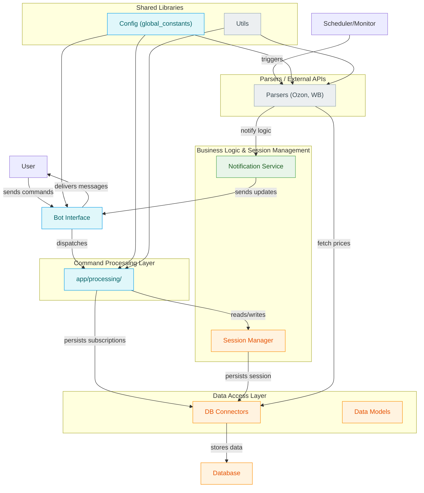

# sale-hunter

sale-hunter is a Python-based tool designed for monitoring and notifying users about sales and price changes on popular e-commerce platforms such as Ozon and Wildberries (WB). It supports automated scheduling to fetch prices and sends notifications upon detecting relevant updates.

## Features

- Monitor product prices from Ozon and Wildberries via parsers
- Schedule periodic price checks and notifications
- Manage user sessions and subscriptions for tailored alerts
- Bot interface for receiving user commands and delivering notifications
- Persistent storage through database integration
- Modular design with separated layers for command processing, business logic, data access, and API parsing

## Architecture Overview

The project is structured into several layers:

- **Bot Interface:** Handles user commands and message delivery
- **Command Processing:** Manages command parsing and session management
- **Business Logic & Session Management:** Maintains user sessions and notification logic
- **Parsers:** Interfaces with external APIs (Ozon, WB) to fetch product data
- **Data Access Layer:** Connects to the database and persists data models
- **Scheduler:** Triggers routine price checks and updates
- **Notification Service:** Sends notifications to users based on price changes



## Installation

1. Clone the repository:

   ```bash
   git clone https://github.com/baikoby228/sale-hunter.git
   cd sale-hunter
   ```

2. Install Python dependencies:

   ```bash
   pip install -r requirements.txt
   ```

3. Configure any global constants or credentials as needed in the configuration files.

## Usage

- Run the bot interface to start receiving user commands.
- Use the provided session management commands to subscribe or unsubscribe from price alerts.
- The scheduler will automatically trigger price checks and notifications based on configured intervals.

Refer to the code documentation in the `app/`, `bot.py`, and `app/parsers/` directories for detailed usage and customization.

## Contributing

Contributions are welcome. Please fork the repository and submit pull requests for any enhancements or bug fixes.

## License

This project is licensed under the AGPL-3.0 License.

