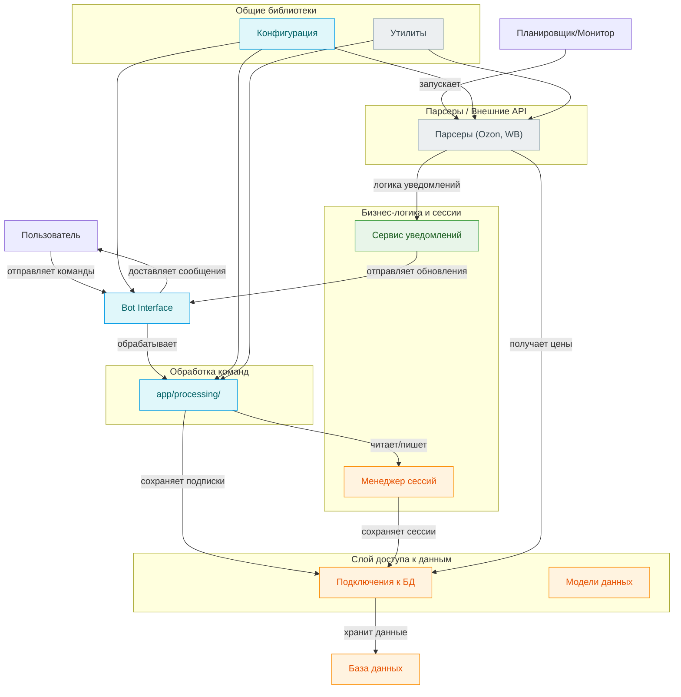

# Sale Hunter 🎯

**sale-hunter** — это мощный Python-инструмент для мониторинга и уведомлений о скидках и изменениях цен на популярных e-commerce платформах, таких как Ozon и Wildberries (WB). Он поддерживает автоматизированную проверку цен и отправляет интеллектуальные уведомления при обнаружении релевантных изменений.

Посмотрите бота в действии: [Лайв Демо](https://t.me/sale_hunter_by_bot)

[English](../README.md) | Русский

## ✨ Возможности

- **Мультиплатформенный мониторинг**: Отслеживание цен товаров с Ozon и Wildberries через специализированные парсеры
- **Гибкое планирование**: Настраиваемые интервалы проверки цен
- **Управление сессиями**: Персонализированные подписки и сессии пользователей
- **Telegram Bot Interface**: Интуитивные команды для удобного взаимодействия
- **Уведомления в реальном времени**: Мгновенные оповещения о снижении цен и акциях
- **Надежное хранение данных**: Интеграция с базой данных для сохранения информации
- **Модульная архитектура**: Четкое разделение ответственности для поддержки кода

## 🏗 Обзор архитектуры

Проект следует модульной архитектуре с четко определенными слоями:



### Ключевые компоненты

- **Bot Interface**: Обрабатывает команды пользователей и доставку сообщений через Telegram
- **Command Processing**: Управляет парсингом команд и сессиями
- **Business Logic & Session Management**: Поддерживает пользовательские сессии и логику уведомлений
- **Parsers**: Взаимодействует с внешними API (Ozon, WB) для получения данных о товарах
- **Data Access Layer**: Подключается к базе данных и сохраняет модели данных
- **Scheduler**: Запускает регулярные проверки цен и обновления
- **Notification Service**: Отправляет уведомления пользователям на основе изменений цен

## 🚀 Быстрый старт

### Предварительные требования

- Python 3.8+
- Токен Telegram бота (от [BotFather](https://t.me/BotFather))
- База данных (SQLite по умолчанию, настраивается на PostgreSQL)

### Установка

1. **Клонируйте репозиторий**:
   ```bash
   git clone https://github.com/baikoby228/sale-hunter.git
   cd sale-hunter
   ```

2. **Установите зависимости**:
   ```bash
   pip install -r requirements.txt
   ```

3. **Настройка конфигурации**:
   Скопируйте шаблон окружения и настройте параметры:
   ```bash
   cp .env.example .env
   # Отредактируйте .env с вашими учетными данными
   ```

4. **Настройка базы данных**:
   ```bash
   python scripts/setup_database.py
   ```

### Использование

1. **Запустите бота**:
   ```bash
   python bot.py
   ```

2. **Взаимодействуйте с ботом**:
   - Старт: `/start` — Инициализация сессии
   - Добавить товар: `/add <ссылка_на_товар>` — Мониторинг нового товара
   - Список подписок: `/list` — Просмотр отслеживаемых товаров
   - Удалить товар: `/remove <id_товара>` — Прекратить мониторинг товара
   - Помощь: `/help` — Показать доступные команды

## 📁 Структура проекта

```
sale-hunter/
├── app/
│   ├── processing/          # Логика обработки команд
│   ├── session/            # Управление сессиями
│   ├── parsers/            # Парсеры для конкретных платформ
│   └── notification.py     # Сервис уведомлений
├── models/                 # Модели данных
├── infra/database/         # Подключения к базе данных
├── docs/                   # Документация
├── bot.py                  # Основной интерфейс бота
└── requirements.txt        # Зависимости Python
```

## 🔧 Конфигурация

Ключевые параметры конфигурации в `.env`:

```env
BOT_TOKEN=your_telegram_bot_token
DATABASE_URL=sqlite:///sale_hunter.db
CHECK_INTERVAL=3600  # Интервал проверки цен в секундах
LOG_LEVEL=INFO
```

## 🤝 Участие в разработке

Мы приветствуем вклад в проект! Пожалуйста, не стесняйтесь создавать issues, запросы функций или pull requests.

1. Форкните репозиторий
2. Создайте ветку для функции: `git checkout -b feature/amazing-feature`
3. Зафиксируйте изменения: `git commit -m 'Add amazing feature'`
4. Запушьте ветку: `git push origin feature/amazing-feature`
5. Откройте pull request

## 📄 Лицензия

Этот проект лицензирован под AGPL-3.0 License — подробности см. в файле [LICENSE](LICENSE).

## 🔗 Ссылки

- [Трекер задач](https://github.com/baikoby228/sale-hunter/issues)
- [Форум обсуждений](https://github.com/baikoby228/sale-hunter/discussions)


